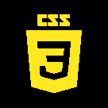
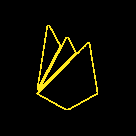

<h1 style="text-align: center;">Hello there, I'm Elona! 👋</h1>

  

<h2 align="center" style="color: #FFE81F;">A long time ago in a galaxy far, far away...</h2>

  It is a period of career transition. Elona Savchenko, a young Front-End Developer, has joined the Rebel Alliance of coders. After completing her training at the GoIT Boot Camp, she is ready to fight the Empire of bugs and build galactic web applications.

---

## 🌟 Jedi Profile: Elona Savchenko

I am a **Front-End Developer**, trained in the ways of the Force (and JavaScript). As a career switcher, I left the dark side of legal paperwork to join the light side of coding. My mission: to create user-friendly, responsive web apps that bring balance to the galaxy.

- 🌍 Based on the planet [Kyiv, Ukraine].
- 🎓 Completed Jedi training at GoIT (2023).
- 🌱 Currently mastering the Force of [Javascript, TypeScript, React.js and Next.js].
- 🎯 My goal: Build apps that are out of this world! 🚀

---

## 🛠️ My Lightsaber Tech Stack

<table align="center">
  <tr>
     <td align="center"  width="88">
         
       JavaScript
    </td>
    <td align="center" width="88">
        
       TypeScript
    </td>
<td align="center" width="88">
         
       HTML5
    </td>
    <td align="center" width="88">
        
       CSS3
    </td>
    <td align="center" width="88">
        
       React.js
    </td>
    <td align="center" width="88">
        
       Next.js
    </td>
    <td align="center" width="88">
        
       Node.js
    </td>
    <td align="center" width="88">
      
       Firebase
    </td>
        <td align="center" width="88">
       
       Tailwind
      </td>
  </tr>
    <td align="center" width="88">
        
       Sass
    </td>
    <td align="center" width="88"> 
        
       MUI
    </td>
    <td align="center"  width="88">
        
       Router
    </td>
    <td align="center" width="88">
        
       Redux
    </td>
      <td align="center" width="88">
        
       Postman
    </td>
      </td>
      <td align="center" width="88">
        
       Axios
     </td>
     <td align="center" width="88">
        
       Git
    </td>
  <td align="center" width="88">
        
       GitHub
     </td>
  <td align="center" width="88">
        
       Figma
     </td>
</table>

## 🚀 My Galactic Projects

### [VI-3](https://vi-3.vercel.app/uk)

A portal for doors, windows, and blinds, powered by the Force of minimalism and bilingual support.  
**Tech**: Next.js, Next Intl, TypeScript, Tailwind CSS, React Hook Form, Canvas

### [Envent](https://envent.vercel.app)

An event platform built with a team of rebels, featuring animations and a light/dark mode switch.  
**Tech**: Next.js, Next Intl, TypeScript, SCSS, Framer Motion, Video.js

### [ITEdu-certification](https://it-certification.vercel.app)

A system for monitoring educational programs, developed with a team of Jedi coders.  
**Tech**: React, Vite, Styled Components, MUI, Redux, Axios

---

## 📡 Contact the Rebel Base

- 📧 Email: [elona539@gmail.com]
- 💼 LinkedIn: [https://www.linkedin.com/in/elona-savchenko-a9a2b586/]

---

## 🌠 My Jedi Stats

<!--  -->

---

  

"Code you must, young Padawan!" — Master Yoda

